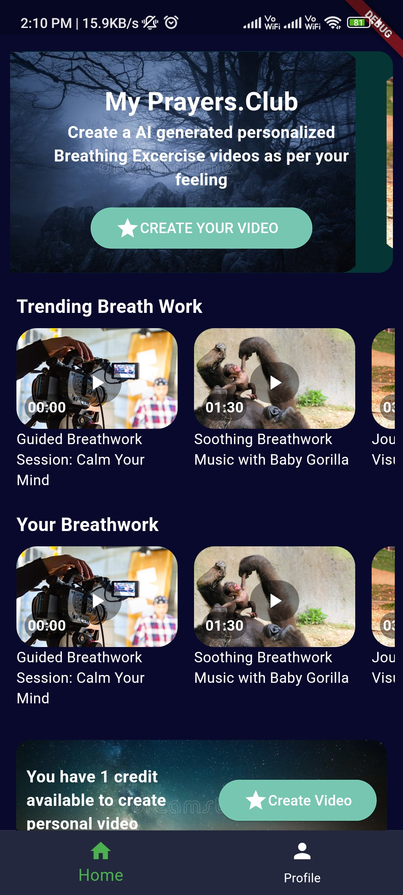

# Flutter App Documentation: TaSk APk

## Overview:

This documentation provides insights into the development process and key decisions made during the creation of the Flutter app "[Your App Name]".

## Project Structure:

### Lib Directory:

- **main.dart:** Entry point of the application.
- **HomePage.dart:** Main screen of the app.
- **ApiService.dart:** Class for handling API requests.
- **CarrouselProvider.dart:** Provider class managing the data for the carousel and breathwork sections.

### Assets:

## Screenshots:

## Technologies Used:

- **Flutter:**
  - Version: [Flutter Version]
  - Utilized Flutter to build a cross-platform mobile application.

- **Packages:**
  - `carousel_slider`: Used for implementing the carousel/slider functionality.
  - `provider`: Implemented state management using the Provider package.
  - `http`: Utilized for making HTTP requests to fetch data from APIs.

## Data Sources:

### Carrousel Images:

- A default list of carousel images is provided in the `CarrouselProvider` class.
- Asynchronous methods (`fetchCarrouselImages`, `fetchTrendingBreathworkImages`, and `fetchBreathworkImages`) are implemented to fetch images from the specified API endpoints. Currently, the endpoints are placeholders and should be replaced with actual API endpoints.

### Breathwork Images:

- Default lists for breathwork and trending breathwork images are provided in the `CarrouselProvider` class.
- Similar to carousel images, asynchronous methods are implemented to fetch breathwork images from API endpoints.

## UI Components:

### Carousel Section:

- Utilized the `carousel_slider` package to create a visually appealing carousel at the top of the home screen.
- Incorporated images fetched from the API or default images.

### Breathwork Sections:

- Implemented two sections for breathwork images: "Trending Breath Work" and "Your Breathwork."
- Utilized `ListView.builder` for rendering a dynamic list of breathwork items.
- Incorporated images, titles, timings, and play buttons.

### Credit and Create Video Section:

- Displayed an informational container with a background image and text.
- Indicated the number of available credits.
- Provided a button to create a video (currently a placeholder).

## Provider Pattern:

- Implemented the `ChangeNotifier` pattern using the `provider` package.
- Created the `CarrouselProvider` class to manage the state related to carousel and breathwork images.
- Utilized `Provider.of` in the `HomePage` to listen to changes in the provider and rebuild the UI accordingly.

## API Requests:

- Utilized the `http` package to make asynchronous API requests.
- Implemented error handling for API requests, notifying users in case of failures.

## Future Improvements:

- Provide actual API endpoints for fetching carousel and breathwork images.
- Enhance error handling and user feedback.
- Implement functionality for creating personalized videos.
- Add unit tests to ensure the robustness of the codebase.

## Conclusion:

The Flutter app TaSk APk was created to offer users a platform for exploring breathwork exercises and creating personalized videos. The project incorporates modern Flutter practices, the Provider pattern for state management, and external packages for enhanced functionality.
